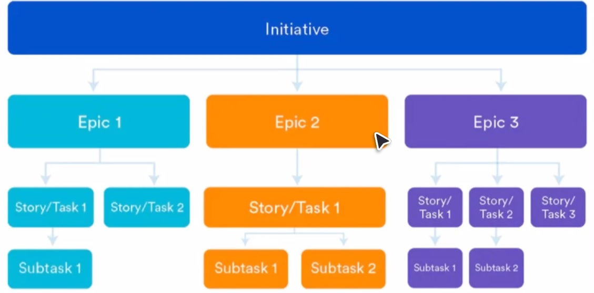
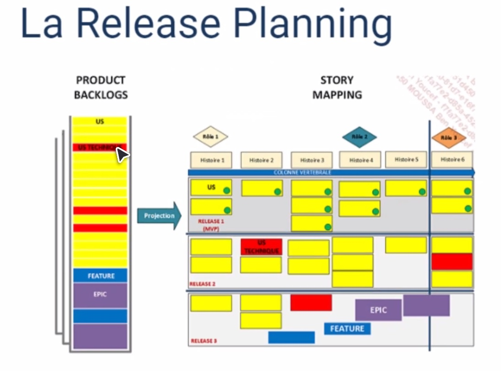

# Cours du 27-02-2023 sur les méthodes Agiles

Formateur : William MESSI  

Lundi - mercredi : Cours  
Jeudi - vendredi : Présentations et préparation à la certification  
  
Lundi : Théorie  
Mardi : Théorie  
Mercredi : Cas pratique de groupe  
Jeudi : Cas pratique de groupe et présentation  

# Présentation d'une journée type

09h00 - 10h45 : En formation  
10h45 - 11h00 : Pause café  
11h00 - 12h30 : Formation  
12h30 - 13h30 : Pause dej  
13h30 - 15h45 : Formation  
15h45 - 16h00 : Pause café  
16h00 - 17h00 : Formation  
<hr>

# Description du module de formation

- Introduction à la gestion de projet  
- Introduction à l'agilité  
- Découverte  
- Les méthodes agiles  
- Mise en place d'un projet  
- Clôture

<hr>

## Introduction à la gestion de projet

1. <a href="#quest-ce-quun-projet">Définir ce qu'est un projet</a>  
2. <a href="#Définir-la-gestion-de-projets">Définir la gestion de projet</a>
3. Identifier les phases du cycle de vie d'un projet
4. Comprendre la "triple contrainte"
5. Comprendre l'environnement de projet

<hr>


### Démystifier un projet

Des projets dans la vie de tous les jours  
Prendre en considération un ensemble de paramètres (projet de voyage ou de mariage par exemple)  
Périmètre, contexte + budget + délai

Projet : Entreprise temporaire décidée dans le but de créer un produit, un service ou un résultat unique.

## Qu'est-ce qu'un projet?

### Temporalité (diapo 12)

Début et fin explicites  

Fins possibles :
- Objectifs du projet atteints  
- Les objectifs du projet ne seront pas ou ne peuvent pas être atteints  
- Les besoins n'existent plus  
- Le client souhaite terminer le projet  

### Utilisation des ressources

Personnes, temps, argent, équipements  
Affectés spécifiquement aux activités du projet

### Résultat unique

Création d'un résultat nouveau, distinctif de tout autre résultat similaire.


## Projet vs Opération

### Projet

Répond aux objectifs stratégiques  
Tournée vers le **changement**  
A une fin  
Config Adhoc  

Résultat unique  
Orienté "produit"  
Retour sur investissement
Équipe et rôles dynamiques  
Leadership et management  

### Opération

Soutient le "business"  
Tourné vers la **stabilité**  
A une continuité  
Systèmes existants  
Travail répétitif  

Orienté "processus"  
Efficacité et efficience  
Équipe et rôles stables  
Management

### Caractéristiques des projets

Début & fin?  
Ressources coordonnées?  
Besoin d'une approche planifiée?  
Objectifs précis définis?  

# Définir la gestion de projets

L'application de connaissances ,de compétences, d'outils et de techniques aux activités de projet afin d'en respecter les exigences.

## Le recueil des besoins

Cela se fait principalement par le cahier des charges.

Deux éléments-clés pour le succès de tout projet :

- La prise en compte des exgiences concurrentes entre le contenu, les délais et les coûts.  
  Pourquoi en a-t-il besoin, comment lui ou ses clients utilisaient le service ?
- L'intégration d'une gestion des risques, de la qualité, des ressources et des parties prenantes

## La réalité :

Chaque projet comportera son lot de 
- changements (sur n'importe quelle contrainte)
- risques
- conflits

Les trois contraintes sont intimement liées

Les comportements de l'équipe de gestion de projet : détection & diagnostic, recommendations et obtenir une approbation.

## Jalons


Déterminer pour chaque phase si terminée ou non, si passage à la phase suivante ou non  
Si pendant besoin No Go : rejet du projet (ou requalification?)  
Stopper/clore si pas d'étape suivante

# En résumé

Un projet crée un produit, un service, un résultat unique.  
Il a une fin unique.

Le management de projet n'est pas une activité administrative.

C'est un processus combinant des techniques et des ressources pour réaliser un objectif précis.

Une bonne mise en oeuvre du management de projet permet de réduire les coûts.

Le management de projet est un processus itératif.

Les contraintes des délais, coûts et contenu sont interdépendantes.

# Pourquoi l'agilité?

Réduire le time-to-market (avant : >4 ans)  
Rythme de développement n'arrivait pas à suivre les besoins des clients (le marché devenant de plus en plus concurrentiel)  
Publication du manifeste agile détaillant les principes de l'agilité  
Adoption du numérique par une majorité de ses acteurs

(Itération = "incrémentation" de version, passage v1 à v2 par modifications via feedback)

- Time-to-market très bas
- Permettre de changer les priorités
- Augmenter la productivité
- Améliorer l'alignement IT/Business

## Valeurs du manifeste Agile

Individus et intéractions >> process et ouils

Applications qui fonctionnent >> documentation exhaustive

Collaboration avec les clients >> Négociation contractuelle

Assumer les changements >> suivre un plan rigoureux

<hr>

## Principes Agiles

### 01 - Satisfaction
- **Satisfaction du client**
- Livraison rapide et régulière de fonctionnalités à **grande valeur ajoutée**

### 02 - Changement
- Accueillir les **changements de besoins**
- Changement = exploiter un avantage compétitif

### 03 - Livrer
- Livrer **fréquemment** un logiciel opérationnel en cycles courts

### 04 - Ensemble
- Privilégier le travail en commun récurrent, tout au long du projet

### 05 - Motivation
- Personnes motivées = meilleure entente générale
- Environnement, soutien, confiance

### 06 - Dialogue
- Rester ouvert à la discussion, au dialogue, pour ne pas perturber les flux d'informations

### 07 - Logiciel opérationnel
- Si c'est opérationnel, on avance
- Voir avec client si modif à apporter ou non etc

### 08 - Rythme soutenable
- Rythme pas trop chargé pour permettre à chaque membre de l'équipe de pouvoir tenir la cadence sur le long terme (bien-être)

### 09 - Excellence technique
- Attention continue à l'**excellence technique** et une **bonne conception**

### 10 - Simplicité
- **Minimiser** la quantité de travail inutile

### 11 - Auto-organisées
- Les équipes savent s'**auto-gérer**

### 12 - Amélioration continue
- L'équipe réfléchit constamment à si elle peut devenir plus efficace

<hr>
Cycle en V

Méthode en cascades (classiques)

Le client fourni une liste d'exigences au préalable avec deadline.

<hr>

## A retenir :
(Gestion de projets - familles)
### Cycle de vie prédictif
Approche plus traditionelle; planification au préalable; puis en une seule fois (séquentiel).

### Cycle de vie itératif
Approche valorisant le retour d'information pour le travail inachevé.

### Cycle de vie incrémental
Approche offrant des livrables finis que le client peut utiliser immédiatement.

### Cycle de vie Agile
Combine l'itératif et l'incrémental pour livrer des produits de qualité, rapidement.

<hr>

## Plusieurs méthodes:
- Scrum
- SAFe
- Lean Startup
- XP
- Kanban
- Lean Software Development

<hr>
<br>

<details>
<summary>**QCM (à ouvrir)**</summary>
<br>
1- Parmis ces propositions, quelles sont les étapes dans l’ordre de la gestion de projet séquentiel ?  
- ~~Tester, coder, concevoir, définir~~  
- ~~Planifier, écrire, coder, tester~~  
- ~~Fiesta,concevoir, coder, tester~~  
- **Définir, concevoir, coder et tester**  

2- Un cahier des charges est un document …  
- ~~Fatiguant~~  
- ~~Fast and furious~~  
- **Contractuel**  

3- Un cahier des charges peut contenir …..  
- ~~Les attentes du coach~~  
- **Les besoins et les attentes du client**  
- **Les fonctionnalités**  
- **Les maquettes**  

4- Un cahier des charges est un document qui va vous permettre de …..  
- ~~Construire une pyramide~~  
- **S’accorder sur les besoins du client**  
- ~~Etablir un dialogue avec le client~~  

5- La maîtrise d’ouvrage (MOA) désigne aussi …  
- **Le client**  
- ~~Le prestataire~~  
- ~~L’expéditeur~~  

6- La maîtrise d’oeuvre (MOE) désigne aussi …  
- **Le prestataire**  
- ~~Le client~~  
- ~~Le coach de sport~~  

7- Dans une approche séquentielle, le chef de projet doit terminer 100% de ses spécifications fonctionnelles avant que les équipes de développement commence à développer  
- **Vrai**  
- ~~Faux~~  

8- Quelle est la triple contrainte d’un projet séquentiel ?
- ~~Budget, luxe, délai~~
- ~~Délai, improvisation, périmètre~~
- **Périmètre, délai, coûts**

9- Qu'est-ce que les méthodes agiles ?  
- ~~Une chaîne de podcasts sur les startups et le growth hacking~~  
- ~~Un programme d'étirements pour se sentir bien dans son corps et mieux gérer le stress~~  
- **Une approche itérative, collaborative et adaptive capable de considérer les besoins du client et ceux liés aux évolutions**  
- ~~Une méthodologie de développement de produits à haute performance~~

10- Quel est le nom du document de référence des méthodes agiles ?  
- ~~Le recueil d'agilité~~  
- ~~Le livre d'Achille~~  
- ~~Le guide de l'Agilité~~  
- **Le manifeste Agile**  

11- Quand a été publié le manifeste Agile ?  
- ~~2012~~  
- ~~2010~~  
- **2001**  
- ~~2005~~  


12- Laquelle de ces propositions ne fait pas partie de la liste des 4 valeurs fondamentales du manifeste Agile ?  
- ~~L'adaptation au changement~~  
- **Le travail avant l'homme**  
- ~~La collaboration avec les clients~~  
- ~~Des logiciels opérationnels~~  


13- Combien de principes fondateurs contient le manifeste Agile ?  
- ~~4~~  
- ~~10~~  
- **12**  
- ~~16~~  

</details>
<br>

<hr>

### Récap

Contractuel = vous protège

Cabinet pour aider à la rédaction du cahier des charges : AMO (Assistance à la maîtrise d'ouvrage)

Séquentiel (trad/classique) plus propice aux projets avec cahier des charges strict et grosse prédictibilité; similarités avec course de relai : une étape après l'autre  
Cycle en V : apporte plus d'immédiateté

MVP = Minimal Viable Product (produit minimal viable -- version minimaliste d'un produit)

<hr>

# La découverte

- Analyser les tendances du marché
- Interview & shadowing (immersion dans l'écosystème du client de pouvoir comprendre ce que l'user fait du produit, ses habitudes : observation ++)
- Formaliser les résultats de ta recherche utilisateur sous forme de Persona

## Identifier un problème
- Touche un grand nombre de personnes
- Problème récurrent
- Sa résolution ne crée pas d'autres contraintes

Les 5 pourquoi :

QQOQCP (équivalent 5W) (faire un état des lieux du problème dans le but) : se baser sur les dires du client

Feature table : lister l'ensemble des fonctionnalités sur le produit et indiquer qu'on a + ce qu'ont les concurrents  
Retour du besoin du client : faire également sa propre recherche  
But : étudier l'écosystème dans lequel on va se lancer

## Persona 

Objectif : Avoir une meilleure idée des problèmes rencontrés par les utilisateurs pour chercher à les résoudre entièrement ou en partie avec notre produit

Principe : développer de l'empathie avec les utilisateurs en se mettant dans leur peau

Comment le remplir : pour chaque utilisateur type du produit identifié lors de la recherche préalable

Définir : l'identité, sa vie, ses habitudes, ses frustrations, ses motivations

https://www.hubspot.fr/make-my-persona

```
Mise en place d’un projet Agile
-- projet fil rouge pour l'agilité --

En groupe vous réalisez une application semblable à celle d’ Airbnb.

Pour ce projet fil rouge, vous allez collaborer ensemble à chaque étapes afin d’identifier et de produire les éléments de chaque étape.

Pour ça vous réaliserez :

Faire un recueil du besoin

Un persona

Feature table

Vous remplissez le Lean Canvas 

Vous réalisez un site mapping de votre solution

Penser le produit en réalisant le story mapping

Rédiger 2 User stories


# N.B/ Vous simulez ce projet. Ne pensez pas aux fonctionnalités dans l’immédiat.

# Objectif de cette mise en pratique:
  - Manipuler et se familiariser avec les concepts évoqués
  - Etre capable de justifier ses choix de méthodes à chaque étapes de votre projet

# Bon à savoir/ 
Si certains éléments ne figurent pas et vous semblent être pertinent à intégrer dans votre projet, vous pouvez le faire.

Vous pouvez vous appuyer sur la documentation transmise hier, faire des recherches sur internet.
```
<hr>
<br>

[Projet fil rouge groupe 3 (AirBnb)](https://docs.google.com/document/d/1DRR3JGCFjYnOYjZKmYuvUA458FdD6igIhP781lsgaw0/edit)

<hr>

# Le Lean Startup

Par Eric Ries  
Méthode connue pour valider de façon itérative une offre, un produit ou un service auprès de la clientèle

On n'avance pas tête baissée dans le développement des fonctionnalités, ergonomie etc de votre produit ou service

Idée -> Construire un MVP (produit minimum viable) -> Mesurer retours utilisateurs -> Apprendre -> Prise de décision (Pivot/Ajustement)

État d'esprit, alerte quand on veut développer. Penser à avoir une approche itérative pour pouvoir aller rapidement confronter le produit aux clients potentiels

## Lean Canvas

Ash Maurya (USA 2010)

Objectif: Mise en pratique de la méthode Lean startup.
Permettre de formaliser votre vision de manière simple avec la possibilité de revenir autant de fois pour ajuster, enrichir, faire un pivot etc.

KPI = Key Performance Indicators


## Site mapping

Architecture modélisée du site internet et des ressources trouvées sur le site internet

## Roadmap

Avec date, membres, progress
Définition

# Scrum

Cadre de travail agile (framework) qui permet à une équipe de collaborer pour atteindre un objectif commun

- Transparence
- Inspection
- Adaptation

## Sprint

Cycle de développement; bloc de temps de durée fixe (2 à 4 semaines); un incrément du produit par cycle

## Rôles

Responsabilités affectées à chaque personne de l'équipe

- Product Owner  
  Responsable produit; à l'écoute des clients; oriente le travail de l'équipe sur l'approche à avoir pour apporter une solution; définit les priorités; accepte ou rejette les résultats
- Scrum Master  
  Responsable de la mise en oeuvre des valeurs et des pratiques du scrum; va fédérer l'équipe; vérifier que l'équipe a les ressources nécessaires pour réaliser son objectif
- Dev Team  
  Responsable du développement des fonctionnalités et contribue aux fonctionnalités

### Rôles non scrum

**Growth Specialist** (Spécialiste croissance)  
  Responsable croissance du produit (marketing)  
  Identification des actions pertinentes pour générer de la croissance  
  Suivi des résultats

**Data Specialist** (Spécialiste données)  
Construire l'architecture permettant la collecte des données  
Co-décisions sur la définition des KPI  
Traitement des données  

**Design**  
Gérer la recherche utilisateur / cohérence visuelle

**QA**  
Empêcher bugs et/ou rupture de service  
Conception/réalisation des tests  


## Artéfacts

Ensemble des informations clés que l'équipe SCRUM et les parties prenantes doivent connaîtres sur l'avancement du produit

Product backlog : ensemble des fonctionnalités que l'on voudrait développer pour le produit 

Sprint backlog : ensemble des éléments jugés prioritaires et prêts à être développés

Incrément : résultat du travail effectué pendant le sprint

## Cérémonies

Moments ayant pour objectif d'organiser le travail en équipe

### Planification

Première réunion avant chaque sprint.  
~1-2 heures; toute l'équipe y participe

- Revue des users stories (déjà dans le backlog)
- Sélection des stories à mettre dans le sprint
- Définition de l'ensemble des tâches de développement
- Définir un responsable pour chaque stories

### Daily meeting (scrum)

~15 mins; en début de journée; heure fixe; animée par scrum master

- Ce qu'on a fait la veille
- Ce qu'on va faire ajd
- Ce qui pose problème

### Réunion d'affinage

Réu quotidienne (par scrum master); heure fixe
~1-2 heures; 1 à 2 fois par sprint

- Présentation des stories à retravailler
- Questions sur chaque stories
- Estimation si OK sinon retravailler

### Revue du sprint

Fin de sprint;
~1-2h; visibilité sur l'avancée, feedback

- Revue de sprint
- Objectifs du sprint
- Feedbacks
- Roadmap

### Rétrospective

Dialogue sur le vécu du sprint pour améliorer les suivants
~1-2h; chaque fin de sprint

- Ouverture du sprint
- Feedback
- Proposition d'axes d'amélioration

<hr>
<br>

<details>
<summary>**QCM Agilité (à dérouler)**</summary>  
<br>

1- Qu'est-ce que les méthodes agiles ?  
Une chaîne de podcasts sur les startups et le growth hacking  
Un programme d'étirements pour se sentir bien dans son corps et mieux gérer le stress  
**Une approche itérative, collaborative et adaptive capable de considérer les besoins du client et ceux liés aux évolutions**  
Une méthodologie de développement de produits à haute performance  

2- Quel est le nom du document de référence des méthodes agiles ?  
Le recueil d'agilité  
Le livre d'Achille  
Le guide de l'Agilité  
**Le manifeste Agile**  

3- Quel est le rôle d'un scrum master ?  
Faire du développement informatique  
Gérer les projets des clients grands comptes  
**Aider une équipe à appliquer les méthodes agiles**  
Maintenir une bonne ambiance au sein des salariés  

4- Lequel de ces termes ne fait pas partie des différents rituels de la méthode Scrum ?  
La rétrospective  
Le sprint planning  
**Le rétroplanning**  
Le daily stand-up meeting  

5- Qu'est-ce qu'une rétrospective ?  
**Une analyse détaillée du sprint pour relever ce qui a fonctionné et ce qui doit être corrigé**  
Un résumé des meilleurs moments de carrière d'un collègue  
Un processus de formation à la méthode Agile  
La réponse D  

6- Parmi ces propositions, quelle est celle qui fait référence à une méthode Agile ?  
Scrumbag  
Cabas  
Kaban  
**Scrumban**  

7- Le product backlog est…  
Un mot de passe qui permet de renforcer la confidentialité d'un projet  
**Un recueil qui contient tous les besoins du client que l'équipe projet doit réaliser**  
Un numéro de série écrit au dos d'un produit  
Un produit qui nécessite une connexion à un back office pour fonctionner  

8- Laquelle de ces propositions ne fait pas partie de la liste des 4 valeurs fondamentales du manifeste Agile ?  
L'adaptation au changement  
**Le travail avant l'homme**  
La collaboration avec les clients  
Des logiciels opérationnels  

9- Combien de principes fondateurs contient le manifeste Agile ?  
4  
10  
**12**  
16  

10- Qu'est-ce que le daily stand-up meeting ?  
Une petit point pour se raconter des blagues afin de détendre l'atmosphère  
Une réunion quotidienne pour partager les dernières news issues de la veille de chacun  
**Un point quotidien de 15mn maximum pour échanger sur les tâches de la veille et celle d'aujourd'hui**  
Une réunion quotidienne debout et dès 9h, qui fait office de réveil musculaire  

11- Qui est le cofondateur de Scrum ?  
**Ken Schwaber**  
John Snaugh  
Larry Page  
Pep Guardiola  

12- Quels sont les 3 pilliers de Scrum ?  
L'échange, l'autonomie, la dérision  
La cohésion, le labeur, la réflexion  
**La transparence, l'inspection, l'adaptation**  
La gouvernance, la ponctualité, la productivité  

13- En agilité, quel terme est utilisé pour désigner un cycle de développement ?  
Une race  
Un fast & furious  
**Un sprint**  

14- Laquelle de ces missions n’est PAS celle d’un Product Owner ?  
Partager la vision produit  
Gérer le backlog  
**Faciliter le travail de l’équipe**  
Maximiser le ROI  

15- Quelle cérémonie permet de présenter les fonctionnalités produits réalisées lors du sprint aux parties prenantes ?  
Le sprint planning  
Le daily scrum meeting  
**La revue de sprint**  
La rétrospective  

16- Quand à lieu la rétrospective ?  
Avant le sprint, pour partir sur de bonnes bases  
Au milieu du sprint, pour faire le point et améliorer ce qui doit l’être  
**Après la revue, pour revenir sur le déroulé du sprint**
</details>
<br>
<hr>
<br>

## Récap

Recueil du besoin client  
Identification du problème  
Problème récurrent? Gd nb de personnes? Engendrer d'autres problèmes?  
Questionnaire utilisateur : ce qu'ils veulent (+ d'arguments = mieux car on comprend mieux les besoins)  
Shadowing = aller dans l'écosystème pour voir l'utilisation faite et les besoins/frustrations (pas d'intéraction, uniquement de l'observation)  
Persona = archétype d'utilisateur pour lequel on cherche à répondre à un besoin spécifique - se mettre à leur place et se poser leurs questions (qu'est-ce que j'aurai aimé à leur place)  


### Story mapping

Visualisation de l'ensemble des fonctionnalités que l'on veut/va avoir  
Ne pas dire "je veux une solution de paiement"; indiquer chaque fonctionnalité voulue pour faciliter le travail de l'équipe dev  
Trouver des thèmes et répertorier les fonctionnalités (from MVP to final product)  

User stories = besoin le plus minimal produit par l'utilisateur

### Site mapping

Arborescence du site (avec les fonctionnalités accessibles à chaque endroit)

### Scrum

Méthode agile qui favorise le travail collaboratif pour atteindre un objectif commun (comparer au Rugby)  
Rôles & cérémonies  

Outils :  

Excel  
Bug Report & Track  
Terllo  
Miro  
Productboard  
Monday  
Frameboard  
Agile Project Management (Eclipse Plugin, IceScrum, Jira, ScrumWorks)  
Notion  

-- Lien vers l'enregistrement fait par Walid sur le discord


# User Story  

User Story = Phrase simple, rédigée dans un langage courant, qui permet de décrire avec suffisamment de précision le contenu d'une fonctionnalité à développer  

Epic = Feature = Fonctionnalités



<br>

User story fonctionnelle = Morceau de fonctionnalité visible pour un utilisateur pour obtenir un feedback  
Remboursement de dette technique = Travailler sur ce qui n'est pas terminer pour ne pas accumuler du retard  
User story technique = Travail non visible pour l'utilisateur  
Correction de bugs = Corriger une imperfection qui nuirait à l'utilisation d'une fonctionnalité  

Rédaction d'user story : travail de synthèse
- A responsabilité unique : Une US ne doit pouvoir faire qu'une seule chose, avoir une seule responsabilité


User story xx/  
ID: XXXX - Valeur: X - Type: Story (fonctionelle etc)  
Titre: X  
En tant que ...  
Je veux ...  
Feature: ...  

## Pertinence : grille INVEST

- Indépendante : indépendantes des unes des autres
- Négociable : pas un contrat, petit descriptif d'une fonctionnalité (pour entamer une discussion pour négocier les détails)
- Valuable : doit apporter de la valeur
- Estimable : l'estimation des US permet de préparer les sprints/releases
- Small : plus elle est petite, plus facilement on peut l'estimer (une seule fonctionnalité ou responsabilité)
- Testable : US courtes et testables sont la clé d'une bonne intégration

## Moscow : Priorité des US

- **M**ust have : indispensables
- **S**hould have : importantes
- **C**ould have : confort
- **W**ant to have but won't have : souhaitables mais reportées

## SMART : synthèse
Plutôt utilisé pour la partie "tâche" des US

- Spécifique
- Mesurable
- Acceptable
- Réaliste
- Temporellement définie


### Régler les conflits de priorité

Planning poker :  
Chacun s'assied autout d'une table  
Explication du scénario  
Séance de Questions/Réponses au responsable du produit (PO) (pour encadrer le "terminé" du produit)  
Chaque personne place une carte  
Si unanimité, OK, sinon re-discussion etc  


## Critères d'acceptation

- Rappeler en quoi consiste le besoin
- Indiquer les validations à effectuer pour s'assurer que le besoin est rempli

### Definition of Ready (DOR)

Vérification que les US d'un sprint soient présentables (intégrables dans le sprint backlog)  
Critères qui déterminent si US prête ou non  
S'appuie en général sur INVEST (affirmer qu'US est ok pour le développement)  
Doit respecter les 6D :
- Désirable : apporter de la valeur
- Décomposée : doit être petite (!= epic)
- Débattue : discutée en équipe
- Dérisquée : risques limités
- Défini de fini : on sait quand elle sera terminée
- Démontrable : peut être présentée en fin de sprint lors de la review (démo)

### Definition of Done (DOD)

Qualité de l'implémentation + traitement de toutes les US
- UT réalisés avec succès
- Code review
- Documentation tech mise à jour

## Burndown chart

Indicateur clé de suivi; suivre l'évolution du produit sur un sprint  
Voir si le rythme estimé est respecté/respectable  
Périmète du sprint; tâches réalisées dans le sprint

## Burnup chart

Matérialisation l'ensemble des sprints par rapport au projet  
Vélocité permet de savoir comment on avance sur le projet (pas indicateur de performance)  
(en moyenne : **4** sprints pour que l'équipe atteigne une vélocité de 100%)




# Kanban

Méthode de travail collectif basé sur la visualisation et la limitation du travail en cours et l'amélioration incrémentale qui trouve sa place dans de nombreuses organisations (adaptée aux contextes présentant beaucoup d'incertitudes)  

Méthodologie de gestion du changement qui permet d'améliorer la façon de travailler, s'appuyant sur la visualisation du flux de travail  
Limiter le volume maximum de tâches en cours à une des étapes du flux permet de désengorger le système et fluidifer la réalisation des tâches  
Méthodes Kanban gagnent à être complétée par d'autres pratiques agiles comme le Stand-up meeting

